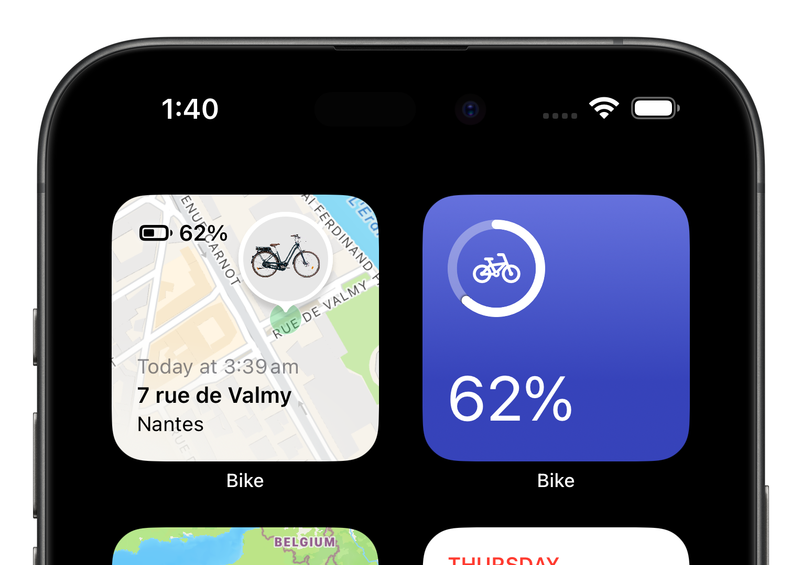
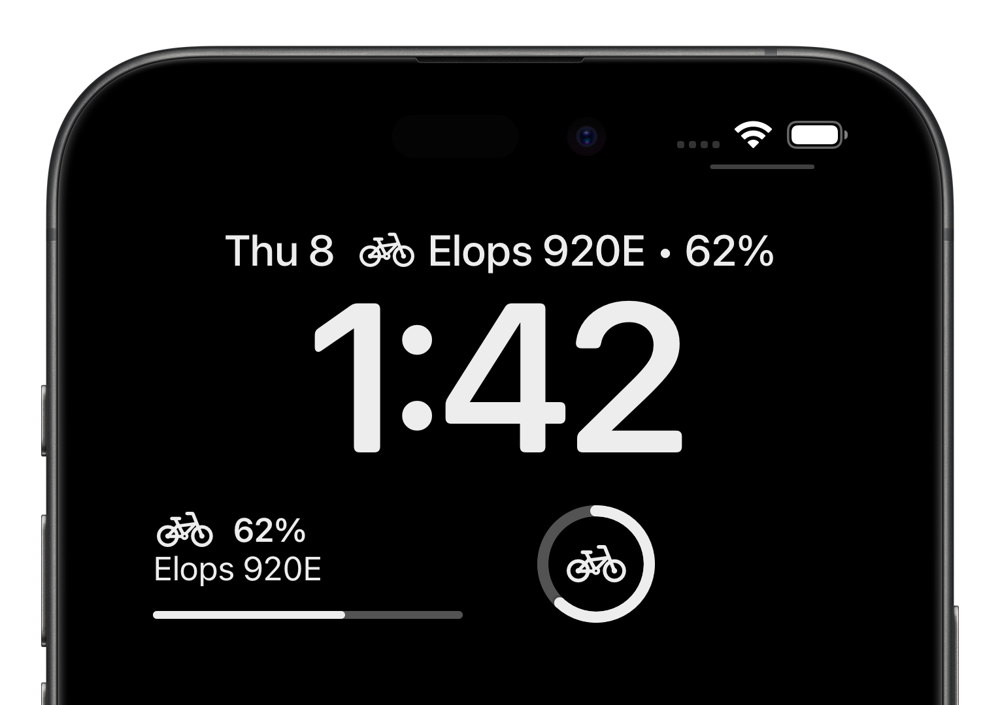
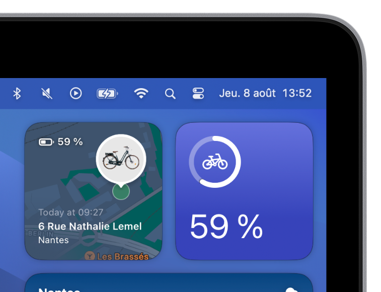

# 🚲 Bike

*Bike* is an iOS/macOS app allowing to track Decathlon connected bikes.

It offers an alternative to the official Decathlon app: [Decathlon Geocover](https://apps.apple.com/fr/app/decathlon-geocover/id1552208973) (previously *Decathlon Mobility*).

As a [Decathlon Elops 920 E](https://www.decathlon.fr/p/velo-de-ville-electrique-connecte-elops-920-e-connect-lf/_/R-p-305573) owner myself, I wanted to see if it was possible to access real-time information about my bike (location, battery level, etc.).

## Features

For the moment, the app essentially provides widgets showing the bike's **location** and **battery level** (the official Decathlon Geocover does not have widgets). The design is inspired from Apple *Find My* and *Battery* widgets.

|     iOS Home Screen widgets: location and battery level      |
| :----------------------------------------------------------: |
|  |

|            iOS Lock Screen widgets: battery level            |
| :----------------------------------------------------------: |
|  |

|   macOS widgets: location and battery level   |
| :-------------------------------------------: |
|  |

More features may be added in the future.

## Technical Stack

The app is built using modern Apple technologies: SwiftUI, Swift 6, Swift Concurrency and Swift Package Manager.