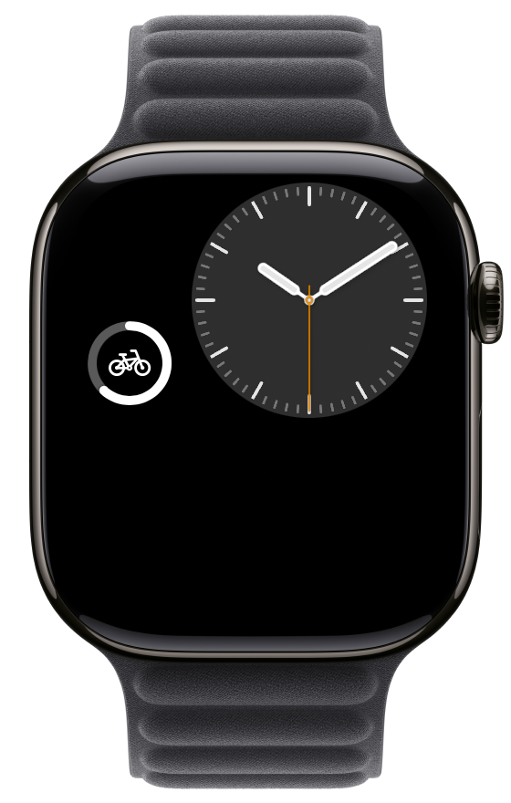
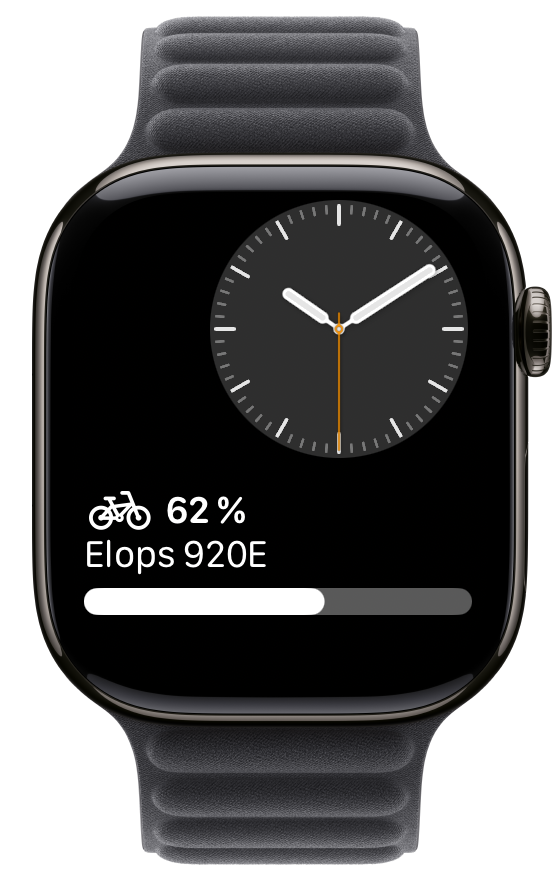
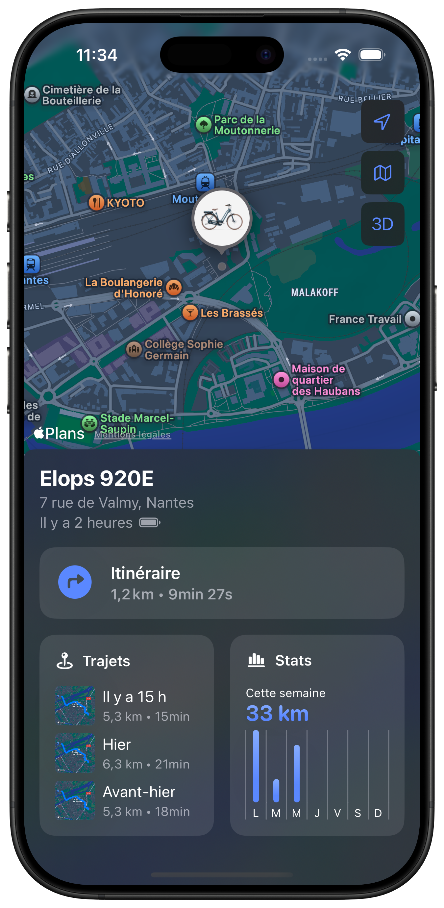
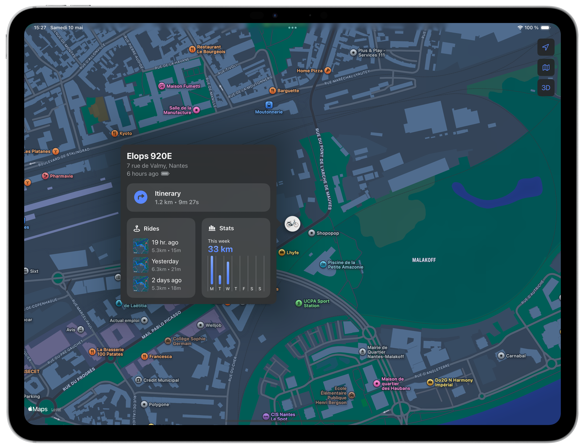

# 🚲 Bike


*Bike* is a multi-platform app allowing to track Decathlon connected bikes. It is available on **iPhone, iPad, Mac, Apple Watch, Apple TV and Apple Vision**. It is entirely built with SwiftUI.

It offers an alternative to the official Decathlon app: [Decathlon Geocover](https://apps.apple.com/fr/app/decathlon-geocover/id1552208973) (previously *Decathlon Mobility*).

As a [Decathlon Elops 920 E](https://www.decathlon.fr/p/velo-de-ville-electrique-connecte-elops-920-e-connect-lf/_/R-p-305573) owner myself, I wanted to see if it was possible to access real-time information about my bike (location, battery level, etc.).

## Features

The app provides essential information about the bike: **location**, **battery level**, **ride details** and **statistics**.

|                  Location and battery level                  |                         Ride details                         |                          Statistics                          |
| :----------------------------------------------------------: | :----------------------------------------------------------: | :----------------------------------------------------------: |
|  |  |  |

Location and battery level are also available as **widgets** (on iPhone, iPad, Mac and Apple Watch). The design is inspired by Apple *Find My* and *Battery* widgets.

|                   iPhone/iPad Home Screen                    |                   iPhone/iPad Lock Screen                    |
| :----------------------------------------------------------: | :----------------------------------------------------------: |
|  |  |

|                             Mac                              |
| :----------------------------------------------------------: |
|  |

| Watch Accessory Circular                                     |                    Watch Accessory Corner                    |                 Watch Accessory Rectangular                  |                    Watch Accessory Inline                    |
| ------------------------------------------------------------ | :----------------------------------------------------------: | :----------------------------------------------------------: | :----------------------------------------------------------: |
|  |  |  |  |

## Platforms

### iPhone



### iPad



### Mac


### Apple Watch


### Apple Vision


### Apple TV


## Technical Stack

The app is built using modern Apple technologies: SwiftUI, Swift 6, Swift Concurrency and Swift Package Manager.

All platforms share the same codebase, thanks to the concept of [SwiftUI Multiplatform apps](https://developer.apple.com/documentation/xcode/configuring-a-multiplatform-app-target).


## Building the project

You need to set up your Team ID before building the project.

1. In the project directory, run the following command to generate the required Xcode Build Configuration file:

```bash
cp Bike.xcconfig.template Bike.xcconfig
```

2. Replace `YOUR_TEAM_ID` by your actual Team ID in the generated `Bike.xcconfig` file.